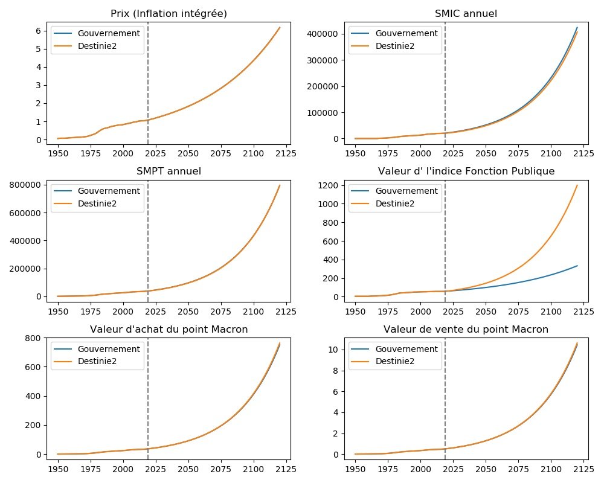
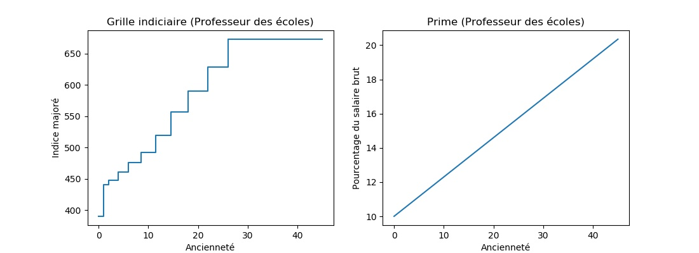
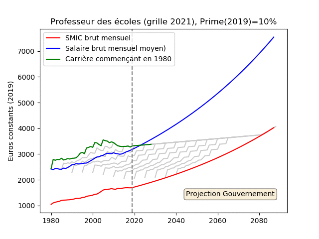
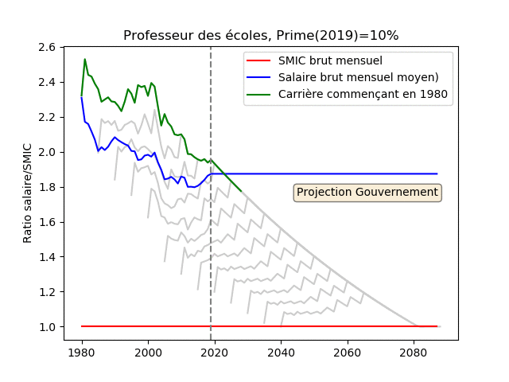

# Simulateur de carrière (salaire et pension de retraite)

Ce projet a pour objectif de 

- de simuler des carrières dans le public comme dans le privé ;
- de donner une vison d'ensemble des carrières (comparaison public, privé, SMIC, salaire moyen) ;
- de calculer pour ces carrières les retraites (système actuel et réforme Macron).

Il permet d'utiliser plusieurs types de projections macro-économiques pour les années à venir:

- les hypothèses du gouvernement (inflation: 1.75%/an, croissance: 1.3%, augm. salaire privé: inflation+croissance, augm. fonctionnaire: indice selon inflation, prime 0.23 point par an) ;
- les hypothèses extraites du modèle Destinie2 utilisé par le COR (inflation 1.75%, croissance 1.3%)

Le code permet de générer les figures et gif animés ci-dessous.

Voila une comparaison des 2 modèles macro-économiques pour l'instant considérés:

Considérons un *professeur des écoles ayant une prime de 10% en 2019*. Voici l'évolution de sa carrière (en point d'indice et en prime):

Dans les hypothèses du gouvernement, voici l'évolution de son salaire en euros constants (2019) par rapport au SMIC et au salaire moyen (SMPT) en fonction de l'année de sa prise de fonction:

Voici la même chose où l'on regarde le ratio salaire/SMIC:

La trop faible augmentation du point d'indice et de la prime fait que son salaire décroche par rapport au salaire moyen et finit par s'approcher du SMIC.

