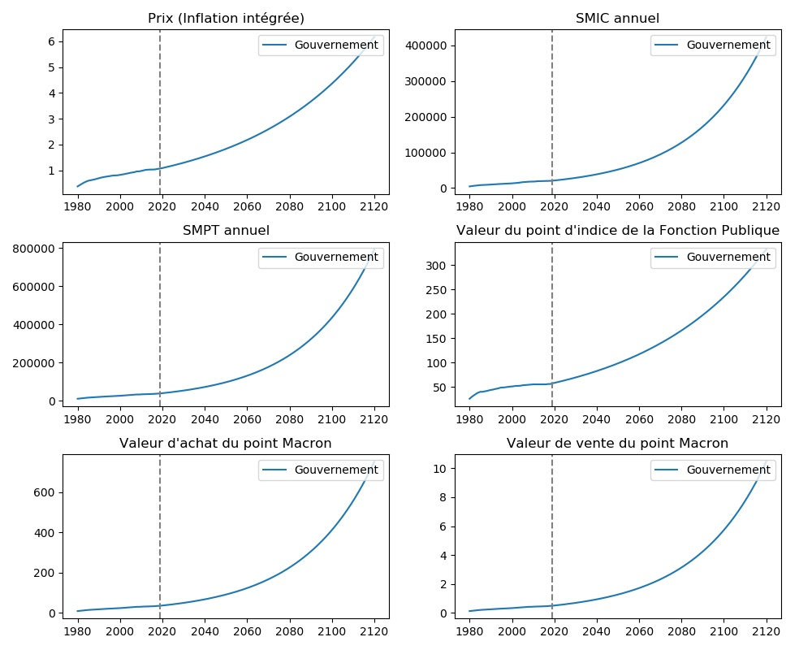
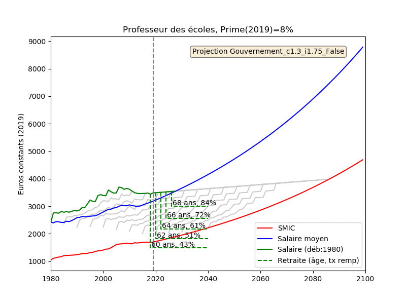
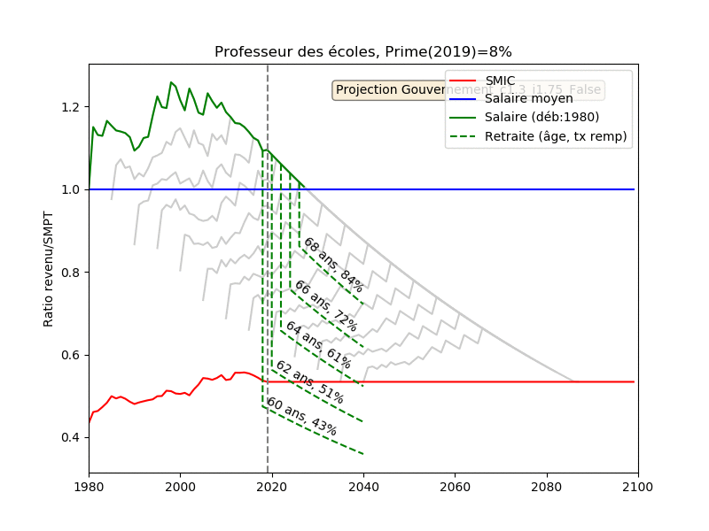

# Simulateur de carrière (salaire et pension de retraite)


Ce projet a pour objectif de 

- de simuler des carrières dans le public comme dans le privé ;
- de donner une vison d'ensemble des carrières (comparaison public, privé, SMIC, salaire moyen) ;
- de calculer pour ces carrières les retraites (système actuel et réforme Macron).

Il permet d'utiliser plusieurs types de projections macro-économiques pour les années à venir:

- les hypothèses du gouvernement (inflation: 1.75%/an, croissance: 1.3%, augm. salaire privé: inflation+croissance, augm. fonctionnaire: indice selon inflation, prime 0.23 point par an) ;
- les hypothèses extraites du modèle Destinie2 utilisé par le COR (inflation 1.75%, croissance 1.3%)

Le code permet de générer les figures et gif animés ci-dessous.

Voila une comparaison des 2 modèles macro-économiques pour l'instant considérés:



Considérons un *professeur des écoles ayant une prime de 7% en 2019*. Voici l'évolution de sa carrière (en point d'indice et en prime):


Dans les hypothèses du gouvernement, voici l'évolution de son salaire en euros constants (2019) par rapport au SMIC et au salaire moyen (SMPT) en fonction de l'année de sa prise de fonction:



Voici la même chose où l'on regarde le ratio salaire/SMIC:



La trop faible augmentation du point d'indice et de la prime fait que son salaire décroche par rapport au salaire moyen et finit par s'approcher du SMIC.

# Deux exemples détaillés

## Professeur des écoles 

an=annuel, mens=mensuel, HP=Hors Prime, EurCour=euros courants, EurConst=euros constants 2019

```+-------+-----+---------+----------+------------+----------------+------------------+----------+------------+-------------+----------------+----------+------------+------------+----------+```<br>
```| Année | Age | Ind maj | IndFP an | IndFP mens | HP EuroCour an | HP EuroCour mens | Tx Prime | EurCour an | EurConst an | EuroConst mens | Tot Pts  | Val Ach Pt | Val Vte Pt | Ind Prix |```<br>
```+-------+-----+---------+----------+------------+----------------+------------------+----------+------------+-------------+----------------+----------+------------+------------+----------+```<br>
```|  2012 |  22 |  390.0  |  55.56   |    4.63    |    21669.76    |     1805.81      |   6.39   |  23054.46  |   24280.03  |    2023.34     |  710.92  |   32.43    |    0.45    |   1.02   |```<br>
```|  2013 |  23 |  441.0  |  55.56   |    4.63    |    24503.50    |     2041.96      |   6.62   |  26125.64  |   27278.70  |    2273.23     | 1513.71  |   32.54    |    0.45    |   1.02   |```<br>
```|  2014 |  24 |  448.0  |  55.56   |    4.63    |    24892.45    |     2074.37      |   6.85   |  26597.58  |   27632.46  |    2302.70     | 2323.68  |   32.84    |    0.46    |   1.03   |```<br>
```|  2015 |  25 |  448.0  |  55.56   |    4.63    |    24892.45    |     2074.37      |   7.08   |  26654.83  |   27681.11  |    2306.76     | 3125.10  |   33.26    |    0.46    |   1.03   |```<br>
```|  2016 |  26 |  461.0  |  55.56   |    4.63    |    25614.77    |     2134.56      |   7.31   |  27487.21  |   28488.56  |    2374.05     | 3939.61  |   33.75    |    0.47    |   1.03   |```<br>
```|  2017 |  27 |  461.0  |  56.23   |    4.69    |    25923.09    |     2160.26      |   7.54   |  27877.69  |   28607.19  |    2383.93     | 4749.41  |   34.43    |    0.48    |   1.04   |```<br>
```|  2018 |  28 |  476.0  |  56.23   |    4.69    |    26766.57    |     2230.55      |   7.77   |  28846.34  |   29192.49  |    2432.71     | 5566.80  |   35.29    |    0.49    |   1.06   |```<br>
```|  2019 |  29 |  476.0  |  57.53   |    4.79    |    27385.74    |     2282.14      |   8.00   |  29576.60  |   29576.60  |    2464.72     | 6385.92  |   36.11    |    0.50    |   1.07   |```<br>
```|  2020 |  30 |  484.0  |  58.54   |    4.88    |    28333.31    |     2361.11      |   8.23   |  30665.14  |   30137.73  |    2511.48     | 7210.06  |   37.21    |    0.52    |   1.09   |```<br>
```|  2021 |  31 |  492.0  |  59.56   |    4.96    |    29305.66    |     2442.14      |   8.46   |  31784.91  |   30700.98  |    2558.41     | 8039.00  |   38.34    |    0.53    |   1.11   |```<br>
```|  2022 |  32 |  492.0  |  60.61   |    5.05    |    29818.51    |     2484.88      |   8.69   |  32409.73  |   30766.08  |    2563.84     | 8859.23  |   39.51    |    0.55    |   1.13   |```<br>
```|  2023 |  33 |  505.5  |  61.67   |    5.14    |    31172.84    |     2597.74      |   8.92   |  33953.46  |   31677.17  |    2639.76     | 9693.09  |   40.72    |    0.57    |   1.15   |```<br>
```|  2024 |  34 |  519.0  |  62.75   |    5.23    |    32565.44    |     2713.79      |   9.15   |  35545.18  |   32591.82  |    2715.99     | 10540.21 |   41.96    |    0.58    |   1.17   |```<br>
```|  2025 |  35 |  519.0  |  63.84   |    5.32    |    33135.34    |     2761.28      |   9.38   |  36243.43  |   32660.50  |    2721.71     | 11378.40 |   43.24    |    0.60    |   1.19   |```<br>
```|  2026 |  36 |  538.0  |  64.96   |    5.41    |    34949.48    |     2912.46      |   9.61   |  38308.12  |   33927.35  |    2827.28     | 12238.12 |   44.56    |    0.62    |   1.21   |```<br>
```|  2027 |  37 |  557.0  |  66.10   |    5.51    |    36816.97    |     3068.08      |   9.84   |  40439.76  |   35199.24  |    2933.27     | 13118.81 |   45.92    |    0.64    |   1.23   |```<br>
```|  2028 |  38 |  557.0  |  67.26   |    5.60    |    37461.27    |     3121.77      |  10.07   |  41233.62  |   35272.94  |    2939.41     | 13990.22 |   47.32    |    0.66    |   1.25   |```<br>
```|  2029 |  39 |  557.0  |  68.43   |    5.70    |    38116.84    |     3176.40      |  10.30   |  42042.87  |   35346.65  |    2945.55     | 14852.43 |   48.76    |    0.68    |   1.27   |```<br>
```|  2030 |  40 |  590.0  |  69.63   |    5.80    |    41081.67    |     3423.47      |  10.53   |  45407.57  |   37518.87  |    3126.57     | 15756.09 |   50.25    |    0.70    |   1.29   |```<br>
```|  2031 |  41 |  590.0  |  70.85   |    5.90    |    41800.60    |     3483.38      |  10.76   |  46298.35  |   37596.94  |    3133.08     | 16650.20 |   51.78    |    0.72    |   1.32   |```<br>
```|  2032 |  42 |  590.0  |  72.09   |    6.01    |    42532.11    |     3544.34      |  10.99   |  47206.39  |   37675.01  |    3139.58     | 17534.86 |   53.36    |    0.74    |   1.34   |```<br>
```|  2033 |  43 |  590.0  |  73.35   |    6.11    |    43276.43    |     3606.37      |  11.22   |  48132.04  |   37753.08  |    3146.09     | 18410.18 |   54.99    |    0.77    |   1.36   |```<br>
```|  2034 |  44 |  629.0  |  74.63   |    6.22    |    46944.47    |     3912.04      |  11.45   |  52319.61  |   40331.86  |    3360.99     | 19333.48 |   56.67    |    0.79    |   1.39   |```<br>
```|  2035 |  45 |  629.0  |  75.94   |    6.33    |    47766.00    |     3980.50      |  11.68   |  53345.07  |   40415.09  |    3367.92     | 20247.03 |   58.39    |    0.81    |   1.41   |```<br>
```|  2036 |  46 |  629.0  |  77.27   |    6.44    |    48601.90    |     4050.16      |  11.91   |  54390.39  |   40498.32  |    3374.86     | 21150.90 |   60.17    |    0.84    |   1.44   |```<br>
```|  2037 |  47 |  629.0  |  78.62   |    6.55    |    49452.44    |     4121.04      |  12.14   |  55455.96  |   40581.56  |    3381.80     | 22045.21 |   62.01    |    0.86    |   1.46   |```<br>
```|  2038 |  48 |  673.0  |  80.00   |    6.67    |    53837.70    |     4486.48      |  12.37   |  60497.43  |   43509.39  |    3625.78     | 22991.94 |   63.90    |    0.89    |   1.49   |```<br>
```|  2039 |  49 |  673.0  |  81.40   |    6.78    |    54779.86    |     4564.99      |  12.60   |  61682.13  |   43598.44  |    3633.20     | 23928.64 |   65.85    |    0.92    |   1.51   |```<br>
```|  2040 |  50 |  673.0  |  82.82   |    6.90    |    55738.51    |     4644.88      |  12.83   |  62889.76  |   43687.50  |    3640.62     | 24855.41 |   67.86    |    0.94    |   1.54   |```<br>
```|  2041 |  51 |  673.0  |  84.27   |    7.02    |    56713.93    |     4726.16      |  13.06   |  64120.77  |   43776.55  |    3648.05     | 25772.36 |   69.93    |    0.97    |   1.57   |```<br>
```|  2042 |  52 |  673.0  |  85.75   |    7.15    |    57706.43    |     4808.87      |  13.29   |  65375.61  |   43865.61  |    3655.47     | 26679.58 |   72.06    |    1.00    |   1.59   |```<br>
```|  2043 |  53 |  673.0  |  87.25   |    7.27    |    58716.29    |     4893.02      |  13.52   |  66654.73  |   43954.66  |    3662.89     | 27577.18 |   74.26    |    1.03    |   1.62   |```<br>
```|  2044 |  54 |  673.0  |  88.77   |    7.40    |    59743.83    |     4978.65      |  13.75   |  67958.60  |   44043.72  |    3670.31     | 28465.25 |   76.52    |    1.07    |   1.65   |```<br>
```|  2045 |  55 |  673.0  |  90.33   |    7.53    |    60789.34    |     5065.78      |  13.98   |  69287.69  |   44132.77  |    3677.73     | 29343.88 |   78.86    |    1.10    |   1.68   |```<br>
```|  2046 |  56 |  673.0  |  91.91   |    7.66    |    61853.16    |     5154.43      |  14.21   |  70642.49  |   44221.83  |    3685.15     | 30213.19 |   81.26    |    1.13    |   1.71   |```<br>
```|  2047 |  57 |  673.0  |  93.51   |    7.79    |    62935.59    |     5244.63      |  14.44   |  72023.48  |   44310.89  |    3692.57     | 31073.26 |   83.74    |    1.17    |   1.74   |```<br>
```|  2048 |  58 |  673.0  |  95.15   |    7.93    |    64036.96    |     5336.41      |  14.67   |  73431.18  |   44399.94  |    3700.00     | 31924.18 |   86.30    |    1.20    |   1.77   |```<br>
```|  2049 |  59 |  673.0  |  96.82   |    8.07    |    65157.61    |     5429.80      |  14.90   |  74866.09  |   44489.00  |    3707.42     | 32766.05 |   88.93    |    1.24    |   1.80   |```<br>
```|  2050 |  60 |  673.0  |  98.51   |    8.21    |    66297.86    |     5524.82      |  15.13   |  76328.73  |   44578.05  |    3714.84     | 33598.97 |   91.64    |    1.28    |   1.83   |```<br>
```|  2051 |  61 |  673.0  |  100.23  |    8.35    |    67458.08    |     5621.51      |  15.36   |  77819.64  |   44667.11  |    3722.26     | 34423.02 |   94.44    |    1.31    |   1.86   |```<br>
```|  2052 |  62 |  673.0  |  101.99  |    8.50    |    68638.59    |     5719.88      |  15.59   |  79339.35  |   44756.16  |    3729.68     | 35238.30 |   97.32    |    1.35    |   1.90   |```<br>
```|  2053 |  63 |  673.0  |  103.77  |    8.65    |    69839.77    |     5819.98      |  15.82   |  80888.42  |   44845.22  |    3737.10     | 36044.90 |   100.28   |    1.40    |   1.93   |```<br>
```|  2054 |  64 |  673.0  |  105.59  |    8.80    |    71061.96    |     5921.83      |  16.05   |  82467.41  |   44934.27  |    3744.52     | 36842.90 |   103.34   |    1.44    |   1.96   |```<br>
```|  2055 |  65 |  673.0  |  107.44  |    8.95    |    72305.55    |     6025.46      |  16.28   |  84076.89  |   45023.33  |    3751.94     | 37632.40 |   106.49   |    1.48    |   2.00   |```<br>
```|  2056 |  66 |  673.0  |  109.32  |    9.11    |    73570.90    |     6130.91      |  16.51   |  85717.45  |   45112.38  |    3759.37     | 38413.48 |   109.74   |    1.53    |   2.03   |```<br>
```|  2057 |  67 |  673.0  |  111.23  |    9.27    |    74858.39    |     6238.20      |  16.74   |  87389.68  |   45201.44  |    3766.79     | 39186.23 |   113.09   |    1.57    |   2.07   |```<br>
```|  2058 |  68 |  673.0  |  113.18  |    9.43    |    76168.41    |     6347.37      |  16.97   |  89094.19  |   45290.50  |    3774.21     | 39950.73 |   116.54   |    1.62    |   2.10   |```<br>
```|  2059 |  69 |  673.0  |  115.16  |    9.60    |    77501.35    |     6458.45      |  17.20   |  90831.59  |   45379.55  |    3781.63     | 40707.07 |   120.09   |    1.67    |   2.14   |```<br>
```+-------+-----+---------+----------+------------+----------------+------------------+----------+------------+-------------+----------------+----------+------------+------------+----------+```<br>
```Retraite Macron```<br>
```+-----------------+-----+----------------+-------------------------------+-----------------------------+----------------------+```<br>
```| Année de départ | Age | Surcote/décote | Pension mens brute (EuroCour) | Pension mens brute (EurCst) | Taux de remplacement |```<br>
```+-----------------+-----+----------------+-------------------------------+-----------------------------+----------------------+```<br>
```|       2050      |  60 |     -0.25      |            2678.63            |           1564.39           |        42.11         |```<br>
```|       2051      |  61 |      -0.2      |            3016.56            |           1731.45           |        46.52         |```<br>
```|       2052      |  62 |     -0.15      |            3381.08            |           1907.30           |        51.14         |```<br>
```|       2053      |  63 |      -0.1      |            3773.60            |           2092.11           |        55.98         |```<br>
```|       2054      |  64 |     -0.05      |            4195.61            |           2286.07           |        61.05         |```<br>
```|       2055      |  65 |      0.0       |            4648.65            |           2489.36           |        66.35         |```<br>
```|       2056      |  66 |      0.05      |            5134.36            |           2702.17           |        71.88         |```<br>
```|       2057      |  67 |      0.1       |            5654.41            |           2924.69           |        77.64         |```<br>
```|       2058      |  68 |      0.15      |            6210.58            |           3157.11           |        83.65         |```<br>
```|       2059      |  69 |      0.2       |            6804.69            |           3399.63           |        89.90         |```<br>
```+-----------------+-----+----------------+-------------------------------+-----------------------------+----------------------+```<br>

```## Professeur certifié```<br>

an=annuel, mens=mensuel, HP=Hors Prime, EurCour=euros courants, EurConst=euros constants 2019

```+-------+-----+---------+----------+------------+----------------+------------------+----------+------------+-------------+----------------+----------+------------+------------+----------+```<br>
```| Année | Age | Ind maj | IndFP an | IndFP mens | HP EuroCour an | HP EuroCour mens | Tx Prime | EurCour an | EurConst an | EuroConst mens | Tot Pts  | Val Ach Pt | Val Vte Pt | Ind Prix |```<br>
```+-------+-----+---------+----------+------------+----------------+------------------+----------+------------+-------------+----------------+----------+------------+------------+----------+```<br>
```|  2012 |  22 |  450.0  |  55.56   |    4.63    |    25003.58    |     2083.63      |   7.39   |  26851.34  |   28278.74  |    2356.56     |  828.00  |   32.43    |    0.45    |   1.02   |```<br>
```|  2013 |  23 |  498.0  |  55.56   |    4.63    |    27670.62    |     2305.89      |   7.62   |  29779.12  |   31093.44  |    2591.12     | 1743.06  |   32.54    |    0.45    |   1.02   |```<br>
```|  2014 |  24 |  513.0  |  55.56   |    4.63    |    28504.08    |     2375.34      |   7.85   |  30741.65  |   31937.76  |    2661.48     | 2679.22  |   32.84    |    0.46    |   1.03   |```<br>
```|  2015 |  25 |  513.0  |  55.56   |    4.63    |    28504.08    |     2375.34      |   8.08   |  30807.20  |   31993.36  |    2666.11     | 3605.50  |   33.26    |    0.46    |   1.03   |```<br>
```|  2016 |  26 |  542.0  |  55.56   |    4.63    |    30115.42    |     2509.62      |   8.31   |  32618.01  |   33806.27  |    2817.19     | 4572.04  |   33.75    |    0.47    |   1.03   |```<br>
```|  2017 |  27 |  542.0  |  56.23   |    4.69    |    30477.91    |     2539.83      |   8.54   |  33080.72  |   33946.38  |    2828.86     | 5532.99  |   34.43    |    0.48    |   1.04   |```<br>
```|  2018 |  28 |  579.0  |  56.23   |    4.69    |    32558.50    |     2713.21      |   8.77   |  35413.88  |   35838.85  |    2986.57     | 6536.46  |   35.29    |    0.49    |   1.06   |```<br>
```|  2019 |  29 |  579.0  |  57.53   |    4.79    |    33311.64    |     2775.97      |   9.00   |  36309.69  |   36309.69  |    3025.81     | 7542.06  |   36.11    |    0.50    |   1.07   |```<br>
```|  2020 |  30 |  598.5  |  58.54   |    4.88    |    35036.13    |     2919.68      |   9.23   |  38269.96  |   37611.76  |    3134.31     | 8570.58  |   37.21    |    0.52    |   1.09   |```<br>
```|  2021 |  31 |  618.0  |  59.56   |    4.96    |    36810.76    |     3067.56      |   9.46   |  40293.06  |   38918.98  |    3243.25     | 9621.42  |   38.34    |    0.53    |   1.11   |```<br>
```|  2022 |  32 |  618.0  |  60.61   |    5.05    |    37454.95    |     3121.25      |   9.69   |  41084.34  |   39000.76  |    3250.06     | 10661.18 |   39.51    |    0.55    |   1.13   |```<br>
```|  2023 |  33 |  664.0  |  61.67   |    5.14    |    40947.11    |     3412.26      |   9.92   |  45009.06  |   41991.59  |    3499.30     | 11766.55 |   40.72    |    0.57    |   1.15   |```<br>
```|  2024 |  34 |  710.0  |  62.75   |    5.23    |    44550.03    |     3712.50      |  10.15   |  49071.85  |   44994.60  |    3749.55     | 12936.04 |   41.96    |    0.58    |   1.17   |```<br>
```|  2025 |  35 |  710.0  |  63.84   |    5.32    |    45329.65    |     3777.47      |  10.38   |  50034.87  |   45088.55  |    3757.38     | 14093.18 |   43.24    |    0.60    |   1.19   |```<br>
```|  2026 |  36 |  710.0  |  64.96   |    5.41    |    46122.92    |     3843.58      |  10.61   |  51016.56  |   45182.50  |    3765.21     | 15238.10 |   44.56    |    0.62    |   1.21   |```<br>
```|  2027 |  37 |  757.0  |  66.10   |    5.51    |    50036.71    |     4169.73      |  10.84   |  55460.69  |   48273.62  |    4022.80     | 16445.93 |   45.92    |    0.64    |   1.23   |```<br>
```|  2028 |  38 |  757.0  |  67.26   |    5.60    |    50912.35    |     4242.70      |  11.07   |  56548.35  |   48373.80  |    4031.15     | 17640.99 |   47.32    |    0.66    |   1.25   |```<br>
```|  2029 |  39 |  757.0  |  68.43   |    5.70    |    51803.32    |     4316.94      |  11.30   |  57657.09  |   48473.97  |    4039.50     | 18823.42 |   48.76    |    0.68    |   1.27   |```<br>
```|  2030 |  40 |  757.0  |  69.63   |    5.80    |    52709.88    |     4392.49      |  11.53   |  58787.32  |   48574.14  |    4047.84     | 19993.34 |   50.25    |    0.70    |   1.29   |```<br>
```|  2031 |  41 |  800.0  |  70.85   |    5.90    |    56678.78    |     4723.23      |  11.76   |  63344.21  |   51439.16  |    4286.60     | 21216.64 |   51.78    |    0.72    |   1.32   |```<br>
```|  2032 |  42 |  800.0  |  72.09   |    6.01    |    57670.66    |     4805.89      |  11.99   |  64585.37  |   51545.02  |    4295.42     | 22426.99 |   53.36    |    0.74    |   1.34   |```<br>
```|  2033 |  43 |  800.0  |  73.35   |    6.11    |    58679.90    |     4889.99      |  12.22   |  65850.58  |   51650.88  |    4304.24     | 23624.53 |   54.99    |    0.77    |   1.36   |```<br>
```|  2034 |  44 |  800.0  |  74.63   |    6.22    |    59706.80    |     4975.57      |  12.45   |  67140.29  |   51756.75  |    4313.06     | 24809.38 |   56.67    |    0.79    |   1.39   |```<br>
```|  2035 |  45 |  830.0  |  75.94   |    6.33    |    63029.85    |     5252.49      |  12.68   |  71022.04  |   53807.45  |    4483.95     | 26025.65 |   58.39    |    0.81    |   1.41   |```<br>
```|  2036 |  46 |  830.0  |  77.27   |    6.44    |    64132.88    |     5344.41      |  12.91   |  72412.43  |   53917.28  |    4493.11     | 27229.02 |   60.17    |    0.84    |   1.44   |```<br>
```|  2037 |  47 |  830.0  |  78.62   |    6.55    |    65255.20    |     5437.93      |  13.14   |  73829.73  |   54027.12  |    4502.26     | 28419.62 |   62.01    |    0.86    |   1.46   |```<br>
```|  2038 |  48 |  830.0  |  80.00   |    6.67    |    66397.17    |     5533.10      |  13.37   |  75274.47  |   54136.95  |    4511.41     | 29597.60 |   63.90    |    0.89    |   1.49   |```<br>
```|  2039 |  49 |  830.0  |  81.40   |    6.78    |    67559.12    |     5629.93      |  13.60   |  76747.16  |   54246.78  |    4520.56     | 30763.08 |   65.85    |    0.92    |   1.51   |```<br>
```|  2040 |  50 |  830.0  |  82.82   |    6.90    |    68741.40    |     5728.45      |  13.83   |  78248.34  |   54356.61  |    4529.72     | 31916.19 |   67.86    |    0.94    |   1.54   |```<br>
```|  2041 |  51 |  830.0  |  84.27   |    7.02    |    69944.38    |     5828.70      |  14.06   |  79778.56  |   54466.44  |    4538.87     | 33057.05 |   69.93    |    0.97    |   1.57   |```<br>
```|  2042 |  52 |  830.0  |  85.75   |    7.15    |    71168.40    |     5930.70      |  14.29   |  81338.37  |   54576.27  |    4548.02     | 34185.79 |   72.06    |    1.00    |   1.59   |```<br>
```|  2043 |  53 |  830.0  |  87.25   |    7.27    |    72413.85    |     6034.49      |  14.52   |  82928.34  |   54686.10  |    4557.17     | 35302.53 |   74.26    |    1.03    |   1.62   |```<br>
```|  2044 |  54 |  830.0  |  88.77   |    7.40    |    73681.09    |     6140.09      |  14.75   |  84549.05  |   54795.93  |    4566.33     | 36407.40 |   76.52    |    1.07    |   1.65   |```<br>
```|  2045 |  55 |  830.0  |  90.33   |    7.53    |    74970.51    |     6247.54      |  14.98   |  86201.09  |   54905.76  |    4575.48     | 37500.51 |   78.86    |    1.10    |   1.68   |```<br>
```|  2046 |  56 |  830.0  |  91.91   |    7.66    |    76282.50    |     6356.87      |  15.21   |  87885.06  |   55015.59  |    4584.63     | 38582.00 |   81.26    |    1.13    |   1.71   |```<br>
```|  2047 |  57 |  830.0  |  93.51   |    7.79    |    77617.44    |     6468.12      |  15.44   |  89601.57  |   55125.42  |    4593.79     | 39651.97 |   83.74    |    1.17    |   1.74   |```<br>
```|  2048 |  58 |  830.0  |  95.15   |    7.93    |    78975.74    |     6581.31      |  15.67   |  91351.24  |   55235.25  |    4602.94     | 40710.56 |   86.30    |    1.20    |   1.77   |```<br>
```|  2049 |  59 |  830.0  |  96.82   |    8.07    |    80357.82    |     6696.48      |  15.90   |  93134.71  |   55345.08  |    4612.09     | 41757.86 |   88.93    |    1.24    |   1.80   |```<br>
```|  2050 |  60 |  830.0  |  98.51   |    8.21    |    81764.08    |     6813.67      |  16.13   |  94952.63  |   55454.91  |    4621.24     | 42794.01 |   91.64    |    1.28    |   1.83   |```<br>
```|  2051 |  61 |  830.0  |  100.23  |    8.35    |    83194.95    |     6932.91      |  16.36   |  96805.65  |   55564.74  |    4630.40     | 43819.11 |   94.44    |    1.31    |   1.86   |```<br>
```|  2052 |  62 |  830.0  |  101.99  |    8.50    |    84650.86    |     7054.24      |  16.59   |  98694.44  |   55674.57  |    4639.55     | 44833.28 |   97.32    |    1.35    |   1.90   |```<br>
```|  2053 |  63 |  830.0  |  103.77  |    8.65    |    86132.25    |     7177.69      |  16.82   | 100619.70  |   55784.41  |    4648.70     | 45836.63 |   100.28   |    1.40    |   1.93   |```<br>
```|  2054 |  64 |  830.0  |  105.59  |    8.80    |    87639.57    |     7303.30      |  17.05   | 102582.12  |   55894.24  |    4657.85     | 46829.27 |   103.34   |    1.44    |   1.96   |```<br>
```|  2055 |  65 |  830.0  |  107.44  |    8.95    |    89173.26    |     7431.11      |  17.28   | 104582.40  |   56004.07  |    4667.01     | 47811.32 |   106.49   |    1.48    |   2.00   |```<br>
```|  2056 |  66 |  830.0  |  109.32  |    9.11    |    90733.79    |     7561.15      |  17.51   | 106621.28  |   56113.90  |    4676.16     | 48782.88 |   109.74   |    1.53    |   2.03   |```<br>
```|  2057 |  67 |  830.0  |  111.23  |    9.27    |    92321.64    |     7693.47      |  17.74   | 108699.49  |   56223.73  |    4685.31     | 49744.06 |   113.09   |    1.57    |   2.07   |```<br>
```|  2058 |  68 |  830.0  |  113.18  |    9.43    |    93937.26    |     7828.11      |  17.97   | 110817.79  |   56333.56  |    4694.46     | 50694.97 |   116.54   |    1.62    |   2.10   |```<br>
```|  2059 |  69 |  830.0  |  115.16  |    9.60    |    95581.17    |     7965.10      |  18.20   | 112976.94  |   56443.39  |    4703.62     | 51635.72 |   120.09   |    1.67    |   2.14   |```<br>
```+-------+-----+---------+----------+------------+----------------+------------------+----------+------------+-------------+----------------+----------+------------+------------+----------+```<br>
```Retraite Macron```<br>
```+-----------------+-----+----------------+-------------------------------+-----------------------------+----------------------+```<br>
```| Année de départ | Age | Surcote/décote | Pension mens brute (EuroCour) | Pension mens brute (EurCst) | Taux de remplacement |```<br>
```+-----------------+-----+----------------+-------------------------------+-----------------------------+----------------------+```<br>
```|       2050      |  60 |     -0.25      |            3411.69            |           1992.52           |        43.12         |```<br>
```|       2051      |  61 |      -0.2      |            3839.96            |           2204.07           |        47.60         |```<br>
```|       2052      |  62 |     -0.15      |            4301.71            |           2426.64           |        52.30         |```<br>
```|       2053      |  63 |      -0.1      |            4798.71            |           2660.45           |        57.23         |```<br>
```|       2054      |  64 |     -0.05      |            5332.84            |           2905.72           |        62.38         |```<br>
```|       2055      |  65 |      0.0       |            5906.04            |           3162.69           |        67.77         |```<br>
```|       2056      |  66 |      0.05      |            6520.34            |           3431.60           |        73.39         |```<br>
```|       2057      |  67 |      0.1       |            7177.86            |           3712.68           |        79.24         |```<br>
```|       2058      |  68 |      0.15      |            7880.83            |           4006.17           |        85.34         |```<br>
```|       2059      |  69 |      0.2       |            8631.55            |           4312.33           |        91.68         |```<br>
```+-----------------+-----+----------------+-------------------------------+-----------------------------+----------------------+```<br>
